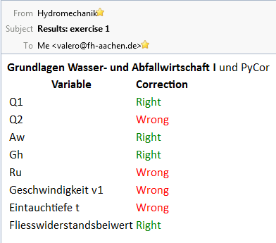
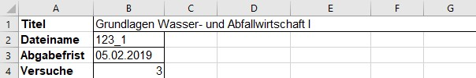
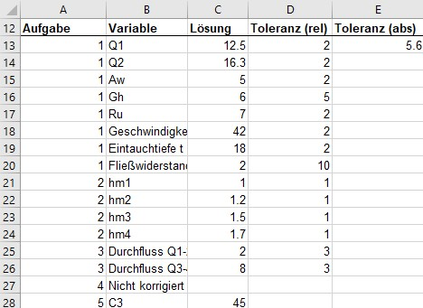
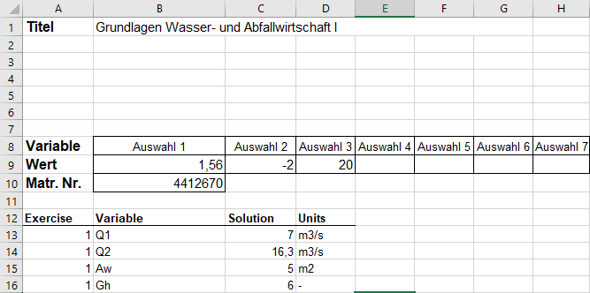
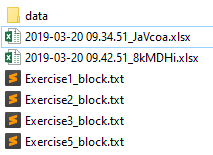

% PyCor - Anleitung
%
% Stand: 01.03.2020
## Was ist PyCor?
PyCor (**Py**thon **Cor**rector) ist ein Programm implementiert in Python, das 
automatisiert Aufgaben korrigieren kann.
Es erwartet Einsendungen von Studenten auf einer Mail-Adresse und korrigiert 
diese mittels einer Excel-Vorlage.

## Was kann PyCor?
- Einzelne Aufgaben korrigieren. Wird eine Aufgabe nicht vollständig abgegeben, 
wird diese ignoriert.
- Komplexe Lösungen vergleichen, die auf der Matrikelnummer und bis zu 8 
anderen Variablen basieren.
   - Werden mehr benötigt, kann die Anzahl in Feld C7 hinterlegt werden.
- Erkennen, ob Studierende unter mehreren Matrikelnummern abgeben.
- Sowohl absolute als auch relative Toleranz pro Ergebnis berücksichtigen.
- Eine maximale Versuchszahl berücksichtigen und danach Nutzer sperren.
- Die Frist zur Abgabe beachten und alle Einsendungen danach ignorieren.

## Einschränkungen
- Die `corrector`-Datei **muss** mit Excel erstellt werden, Libre-/OpenOffice 
wird nicht unterstützt.
- Sowohl der `corrector` als auch die einzusendende Datei muss der Vorlage 
entsprechen.

## Wie funktioniert PyCor?
Vollständig oder teilweise gelöste Aufgaben können von Studierenden in die 
vorgegebene Vorlage eingetragen und an die E-Mail-Adresse 
`uebungen.bau@fh-aachen.de` gesendet werden. Dabei darf der Dateiname nicht 
geändert werden und die Dateiendung **muss** `.xlsx` sein. Beachtet der/die 
Studierende dies nicht, wird er/sie darauf hingewiesen.

Anhand des Dateinamens wird der zugehörige `corrector` festgestellt und die 
Lösungen werden verglichen, danach erhält der Studierende eine Antwort-Mail 
mit der Info, ob die Lösung korrekt war.

{ height=250px }

## Post-Processing/Statistiken
Sobald PyCor Dateien erhält und korrigiert hat, wird ein Ordner namens 
`_postprocessing` erstellt, der folgende Statistiken enthält:

  Dateiname             Inhalt
---------------------   --------
AttemptsInfo.csv        Die Anzahl der Versuche, die ein(e) Student(in) 
                        pro Aufgabe abgegeben hat
cheaters.txt            Studierende, die Lösungen mit mehreren Matrikelnummern 
                        eingereicht haben
GeneralInfo.csv         Die maximal erreichte Punktzahl (in Prozent) pro 
                        Aufgabe pro Student(in)
Exercise_*n*_distr.png  Graphische Darstellung der eingereichten Lösungen 
                        und Anzahl der Studierenden, die die Aufgabe 
                        vollständig gelöst haben
passed-submitted.png    Balkendiagramm mit Vergleich der Anzahl der 
                        Studierenden, die eine Lösung eingereicht haben, und 
                        derer, die die Aufgabe bestanden haben
---------------------   --------

## Wie kann ich PyCor nutzen?
Im Grunde sind nur zwei Dinge dafür nötig:

##### - `corrector.xlsx`:
Diese Datei enthält alle für PyCor nötigen Informationen (Titel, Aufgaben, Formeln) und wird von 
Dozenten/Hiwis erstellt und bearbeitet. Dabei muss sich in der ersten Arbeitsmappe an die vorgegebenen 
Strukturen gehalten werden, weitere Arbeitsmappen oder Makros können aber zur Berechnung von Ergebnissen 
hinzugezogen werden. Es werden `.xlsx` und `.xlsm` unterstützt.

##### - `exercise.xlsx`:
Diese Datei enthält die Matrikelnummer, bis zu 8 festgelegte Variablen, und die Lösungen des Studierenden.
Die Liste von Aufgaben/Variablennamen kann aus der `corrector.xlsx` kopiert werden, dabei sollten aber nur 
die Werte eingefügt werden, sodass die Dateien nicht verknüpft werden. Hier werden nur `.xlsx` akzeptiert.

### Vorbereitung der `corrector.xlsx`
#### Grundinfos
In den ersten vier Zeilen sind folgende Werte einzutragen:

- **Titel:**
Wird in der Grußformel der Mails an Studenten genutzt

- **Dateiname:**
Von Studenten eingesandte Dateien werden anhand des Namens (ohne .xlsx!) dem corrector zugeordnet, 
dabei müssen diese Dateien auf .xlsx enden. Im Feld des correctors sollte lediglich der Dateiname 
selbst ohne Dateiendung (`203131_2` statt `203131_2.xlsx`) eingetragen werden.

- **Abgabefrist:**
Frist, nach der Einsendungen nicht mehr korrigiert werden. Im Beispiel unten wird noch bis einschließlich 
05.02.2019 korrigiert.

- **Versuche:**
Die Anzahl der Versuche pro Aufgabe. Wird die Aufgabe n mal falsch beantwortet, wird der Nutzer gesperrt. 
Eine Freischaltung erfolgt durch das Löschen der jeweiligen Datei namens `Exercise1_block.txt` im 
Nutzerordner.

#### Aufgaben
Die Aufgaben bzw. Ergebnisse sind ab Reihe 13 definiert und bestehen aus den folgenden 5 Spalten:

- **Aufgabe:**
Die Nummer in dieser Spalte entspricht der Aufgabennummer, wobei diese fortlaufend sein 
muss und auch Aufgaben enthält, die nicht von PyCor korrigiert werden sollen.

- **Variable:**
Hier eingegebene Namen werden in der Mail an Studenten genutzt und dienen der Orientierung.

- **Lösung:**
Dieses Feld enthält die Lösung der jeweiligen Variable. Ist es leer, wird die Aufgabe von PyCor ignoriert

- **Toleranz (rel)/(abs):**
Hier kann eine relative und/oder absolute inklusive Toleranz festgelegt werden. Die eingereichte Lösung muss mindestens in 
einen Toleranzbereich fallen, damit sie als gültig gewertet wird. Wird keine Toleranz angegeben, existiert auch dazu 
auch kein gültiger Bereich.

### Vorbereitung der `exercise.xlsx`
Im Grunde kann hier die `corrector.xlsx` als Vorlage genutzt werden, allerdings werden lediglich die die frei wählbaren 
Variablen (`B9-I9`), die Matrikelnummer (`B10`), und die eingetragenen Lösungen (`C13-C??`) ausgelesen. Die restlichen 
Felder können frei für weitere Informationen genutzt werden.

### Wie kann ich Studierende entblocken/mehr Versuche erlauben?
Neben der `corrector.xlsx` werden Ordner nach dem Schema `max.mustermann@alumni.fh-aachen.de` angelegt.
Innerhalb dieses Ordners finden Sie eingesandte Excel-Dateien und pro Aufgabe eine Datei, in der die 
Lösungsversuche notiert werden. Ist diese komplett mit Werten über 0 gefüllt, wird der/die Studierende blockiert.

Wird diese Datei gelöscht, können erneut Dateien eingesendet werden.
 

<!-- nodemon --exec "pandoc -f markdown" Anleitung.md -o Anleitung.pdf -->